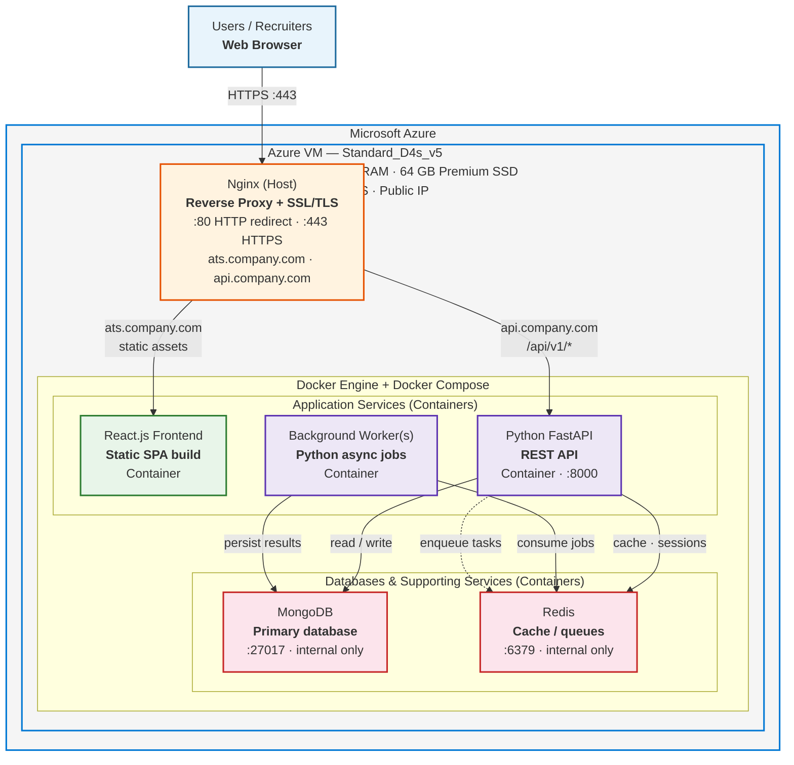
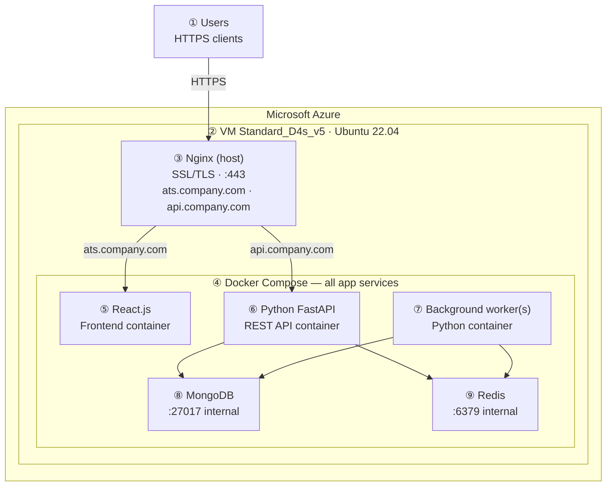
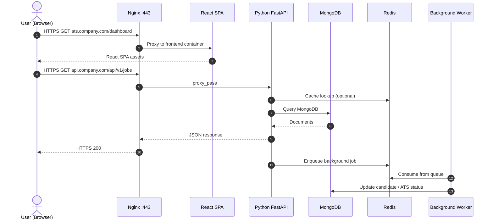
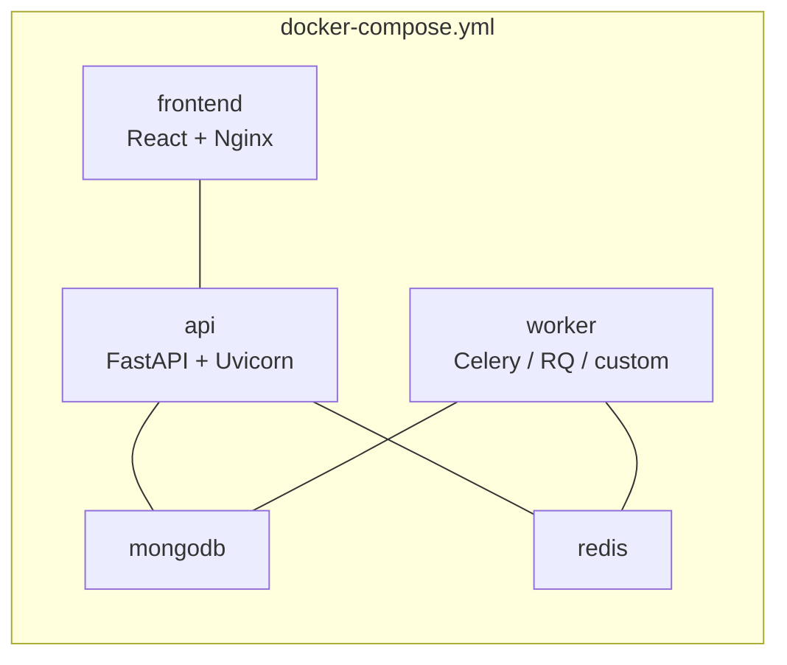

# TalentFlow — Production Architecture

**Document purpose:** Infrastructure / DevOps reference for Azure production deployment  
**Project:** Recruitment Automation Platform (TalentFlow)  
**Cloud provider:** Microsoft Azure  
**Last updated:** 2026-07-09

---

## 1. Infrastructure summary

| Item | Specification |
|------|----------------|
| **Cloud** | Microsoft Azure |
| **VM SKU** | Standard_D4s_v5 |
| **CPU** | 4 vCPU |
| **RAM** | 16 GB |
| **Storage** | 64 GB Premium SSD |
| **OS** | Ubuntu Server 22.04 LTS |
| **Public IP** | Required |
| **Frontend domain** | `ats.company.com` (example) |
| **API domain** | `api.company.com` (example) |

### Host software (provisioned on VM)

- Ubuntu Server 22.04 LTS  
- Docker Engine (latest stable)  
- Docker Compose plugin  
- Nginx (latest stable)  

### Application stack (Docker Compose on same server)

| Service | Technology | Notes |
|---------|------------|-------|
| Frontend | React.js SPA | Static build served via Nginx |
| API | **Python FastAPI** | REST API (`/api/v1/*`) |
| Workers | Python background worker(s) | ATS, email, scheduled jobs |
| Database | MongoDB | Primary persistence |
| Cache / queue | Redis | Sessions, cache, job queues |

---

## 2. Primary architecture diagram (Mermaid)



---

## 3. PNG-friendly simplified diagram (Mermaid)

Best for slides, email, and infra handoff. Export at **1920×1080**.



---

## 4. Component labels (legend)

| # | Component | Role | Exposure |
|---|-----------|------|----------|
| ① | Users | Recruiters access TalentFlow in browser | Internet |
| ② | Azure VM | Single production server hosting all services | Public IP |
| ③ | Nginx | SSL termination, HTTP→HTTPS redirect, domain routing | **:80, :443** (public) |
| ④ | Docker Compose | Orchestrates all application containers | Internal |
| ⑤ | React.js | Recruiter dashboard SPA (`npm run build`) | Via Nginx only |
| ⑥ | Python FastAPI | REST API (`/api/v1/jobs`, `/api/v1/candidates`, etc.) | Via Nginx only |
| ⑦ | Background worker(s) | ATS scoring, email, cron tasks | No public port |
| ⑧ | MongoDB | Jobs, candidates, users, audit data | **:27017 restricted** |
| ⑨ | Redis | Cache, sessions, job queues | **:6379 restricted** |

---

## 5. Network & security

### Public ports (open)

| Port | Protocol | Purpose |
|------|----------|---------|
| 22 | TCP | SSH administration |
| 80 | TCP | HTTP → HTTPS redirect |
| 443 | TCP | HTTPS (Nginx SSL termination) |

### Restricted ports (must NOT be public)

| Port | Service | Access |
|------|---------|--------|
| 27017 | MongoDB | Docker internal network / localhost only |
| 6379 | Redis | Docker internal network / localhost only |
| 8000 | FastAPI | Proxied via Nginx only — not exposed to internet |

### Azure Network Security Group (NSG) recommendation

```
Inbound allow:  22, 80, 443  →  Any (or office IP range for SSH)
Inbound deny:   27017, 6379, 8000  →  Internet
```

---

## 6. Domain & SSL configuration

| Domain | Routes to | Example |
|--------|-----------|---------|
| `ats.company.com` | React frontend (static SPA) | `https://ats.company.com` |
| `api.company.com` | FastAPI backend | `https://api.company.com/api/v1/...` |

**SSL/TLS:** Terminated at Nginx using Let's Encrypt (certbot) or corporate CA certificate.

### Nginx routing (reference)

```nginx
# Frontend — ats.company.com
server {
    listen 443 ssl http2;
    server_name ats.company.com;

    ssl_certificate     /etc/letsencrypt/live/ats.company.com/fullchain.pem;
    ssl_certificate_key /etc/letsencrypt/live/ats.company.com/privkey.pem;

    location / {
        proxy_pass http://127.0.0.1:3000;   # React container
        proxy_set_header Host $host;
        proxy_set_header X-Forwarded-Proto $scheme;
    }
}

# API — api.company.com
server {
    listen 443 ssl http2;
    server_name api.company.com;

    ssl_certificate     /etc/letsencrypt/live/api.company.com/fullchain.pem;
    ssl_certificate_key /etc/letsencrypt/live/api.company.com/privkey.pem;

    location / {
        proxy_pass http://127.0.0.1:8000;   # FastAPI container
        proxy_http_version 1.1;
        proxy_set_header Host $host;
        proxy_set_header X-Real-IP $remote_addr;
        proxy_set_header X-Forwarded-For $proxy_add_x_forwarded_for;
        proxy_set_header X-Forwarded-Proto $scheme;
    }
}

# HTTP → HTTPS redirect (both domains)
server {
    listen 80;
    server_name ats.company.com api.company.com;
    return 301 https://$host$request_uri;
}
```

---

## 7. Request flow (runtime)



---

## 8. Docker Compose service map



Typical `docker-compose.yml` services:

| Service | Image / build | Internal port | Published to host |
|---------|---------------|---------------|-------------------|
| `frontend` | React build + nginx | 3000 | `127.0.0.1:3000` |
| `api` | FastAPI + Uvicorn | 8000 | `127.0.0.1:8000` |
| `worker` | Same image as API, different CMD | — | None |
| `mongodb` | `mongo:7` | 27017 | None (internal network) |
| `redis` | `redis:7-alpine` | 6379 | None (internal network) |

---

## 9. Access requirements (from infra team)

Please provision and share:

- [ ] Root / sudo access  
- [ ] SSH credentials  
- [ ] Public IP address  
- [ ] DNS A-records: `ats.company.com` → Public IP  
- [ ] DNS A-records: `api.company.com` → Public IP  

---

## 10. Backup & recovery

| Backup type | Frequency | Scope |
|-------------|-----------|-------|
| **MongoDB dump** | Daily | All application collections |
| **Azure VM snapshot** | Weekly | Full disk (OS + Docker volumes) |

Recommended:
- Store MongoDB backups in Azure Blob Storage (geo-redundant)
- Test restore procedure before go-live
- Document RPO/RTO with infra team

---

## 11. Pre-production checklist

- [ ] Azure VM `Standard_D4s_v5` provisioned with public IP  
- [ ] Ubuntu 22.04 LTS, Docker, Docker Compose, Nginx installed  
- [ ] NSG: ports 22/80/443 open; 27017/6379 blocked from internet  
- [ ] DNS records for `ats.company.com` and `api.company.com`  
- [ ] SSL certificates installed on Nginx  
- [ ] `docker compose up -d` — all 5 services healthy  
- [ ] FastAPI `/api/v1/health` returns 200 via `api.company.com`  
- [ ] React app loads via `ats.company.com`  
- [ ] MongoDB daily backup job configured  
- [ ] Weekly Azure snapshot policy enabled  
- [ ] Environment secrets in `.env` (not committed to Git)  

---

## 12. Exporting diagrams to PNG

PNGs are pre-generated in `docs/`:

- `PRODUCTION_ARCHITECTURE.png` — full diagram  
- `PRODUCTION_ARCHITECTURE_SIMPLE.png` — slide-friendly  

Regenerate:

```bash
npx @mermaid-js/mermaid-cli \
  -i docs/PRODUCTION_ARCHITECTURE_SIMPLE.mmd \
  -o docs/PRODUCTION_ARCHITECTURE_SIMPLE.png \
  -w 1920 -H 1080 -b white
```

---

## 13. Related documentation

- `docs/DAILY_UPDATES_API.md` — Daily updates API contract  
- `docs/BLACKLIST_LIST_API_BUG.md` — Blacklist API integration notes  
